Exploratory Data Analysis - Week 1
================
Ziq
March 21, 2019

Principles of Analytic Graphics
-------------------------------

**Principle 1**: Show campirsons Evidence for a hypothesis is always relative to another competing hypothesis Ask "compared to what?"

**Principle 2**: Show causaility, mechanisms, systematic structure (what happened, how did it happen?)

**Principle 3**: Show multivariate data The world is inherently multivariate, so we want to see what can tell a much more richer story that is reasonable. We should try to see if there are confounding effects

**Principle 4**: Integration of evidence Integrate words,add data graphics for presentation, but don't let it drive the analysis

**Principle 5**: Describe and document the evidence with appropriate labels, sources etc. Must be credible

**Principle 6**: Content is king. Quality relevance and integrity

Exploratory Graphs
------------------

More or less for yourself to understand data properties, find patterns, suggest modeling strategies, and sometimes to debug analyses.

**Simple Summaries of Data**

-   5-number summary: (min, 1st quartile, median, 3rd quartile, max)
-   Box plots:
-   Histogram: shape of distribution, can add a rug and also increase breaks to have thinner bars
-   Density Plot: sorta like histogram
-   Bar plot Can be used for count.

We can even do multiple types of these plots if you want to separate by factors.

Base Plotting system
--------------------

The basic one that comes with R. It's a palette model so you start with a blank canvas and then build up from there. Start with a plot, add axis, lines, etc.

However, it's hard to go back once the plot just started. It's also just a series of R commands that you'd have to be sort of careful with.

the second one is called the **Lattice System** Plots are created with a single function call. These are good for conditioning plots like looking at how y changes with x across levels of z.

It might not be as intuitive though and you can't add to a plot after it's created. Also requires intense preparation

**ggplot2** is supposed to be similar to the lattice system but much more intuitive and you can add to the plot after it's created.

The Process
-----------

Where will the plot be made? How will the plot be used? (viewing, presented, paper, presentation?) Is there going to be a lot of data?

What graphics system do you want to use? It can't be mixed.

Base graphics are great for 2-D graphics. Many arguments that can be tweaked weeee.

``` r
library(datasets)
hist(airquality$Ozone)
```

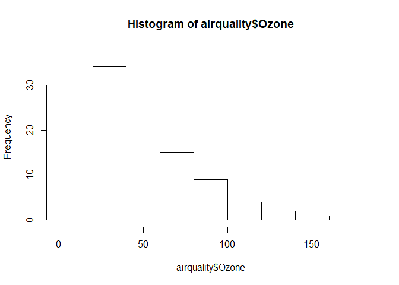

``` r
with(airquality, plot(Wind, Ozone))
```

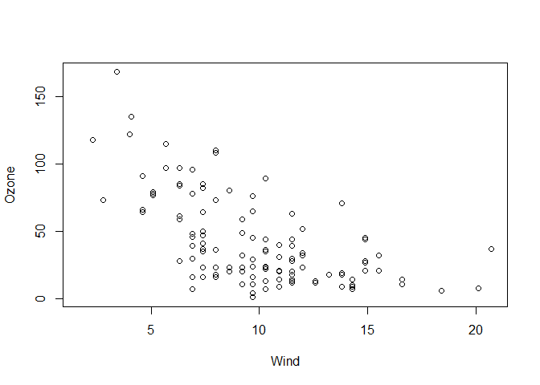

``` r
airquality <- transform(airquality, Month = factor(Month))
boxplot(Ozone ~ Month, airquality, xlab = "Month", ylab = "Ozone (ppb)")
```

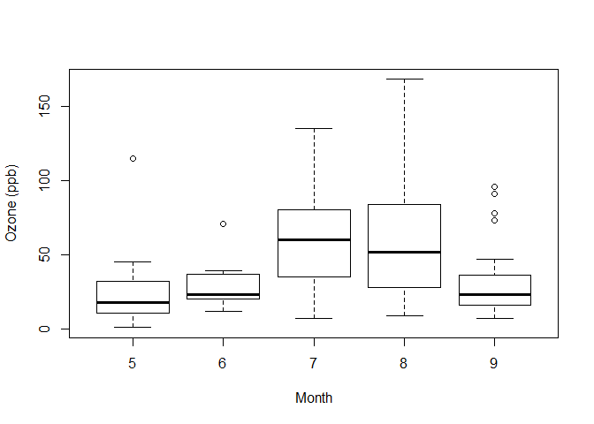

Base graphics parameters
------------------------

pch: the plotting symbol (default is open circle) lty: line type (dash dotted, etc.) lwd: line width specified as an integer multiple col: plotting colors **colors()** gives a vector of colors by name xlab: character string for x-axis label ylab: character string for y-axis label

par() functtion is used to specify GLOBAL graphics parameters that affect all plots in an R session. It can however be overwritten when specified as arguments.

-las: orientation of axis labels on plot -bg: backgroudn color -mar: margin size -oma: outer margin size (default 0) -mfrow: number of plots per row, column -mfcol: number of plots per column, row?

Base Plotting functions
-----------------------

plot: makes a scatterplot lines: adds lines to plot points: add points to a plot text: adds text labels titles: add annotations mtext: adds abritrary text to margins axis: adds axis ticks

``` r
with(airquality, plot(Wind, Ozone, main = "Ozone and ind in New York City"))
with(subset(airquality, Month ==5), points(Wind, Ozone, col = "blue"))
with(subset(airquality, Month != 5), points(Wind, Ozone, col="red"))
```

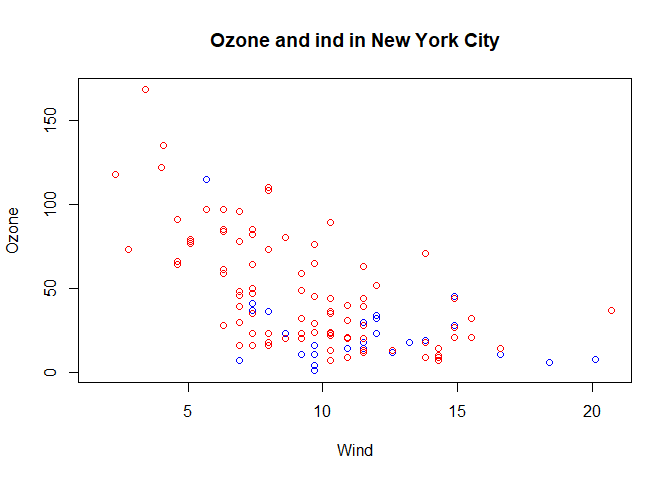

regression line
---------------

``` r
with(airquality, plot(Wind, Ozone, main = "ozone and Wind in NYC", pch = 20))
model <- lm(Ozone~Wind, airquality)
abline(model, lwd=2)
```

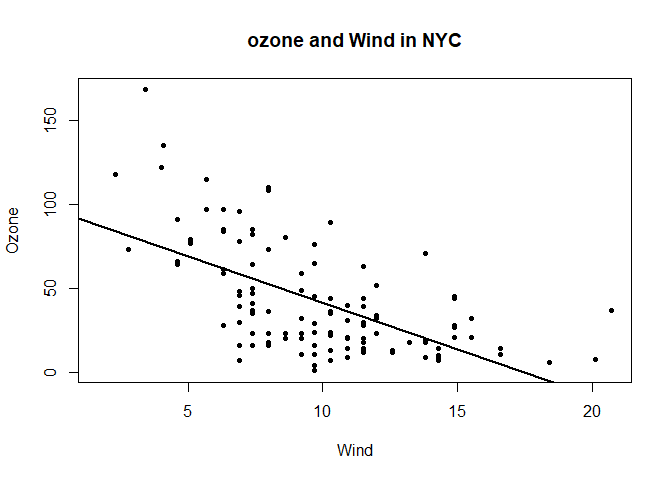

Multiple Base Plots
-------------------

``` r
par(mfrow = c(1,3), mar = c(4,4,2,1), oma = c(0,0,2,0))
with(airquality, {
  plot(Wind, Ozone, main = "Ozone and Wind")
  plot(Solar.R, Ozone, main = "Ozone and Solar Radiation")
  plot(Temp, Ozone, main = "Ozone and Temperature")
  mtext("Ozone and Weather in NYC", outer = TRUE)
})
```

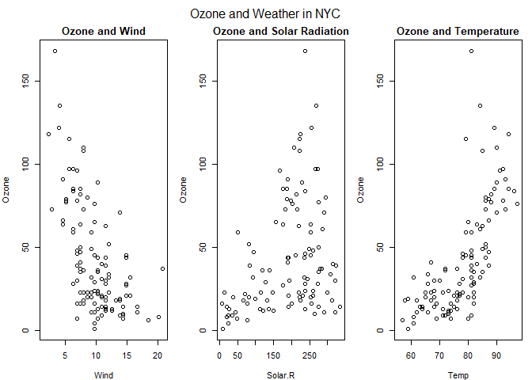

Examples
--------

``` r
x <- rnorm(100)
hist(x) # Notice that titles and labels are there. Frequency is a default label
```

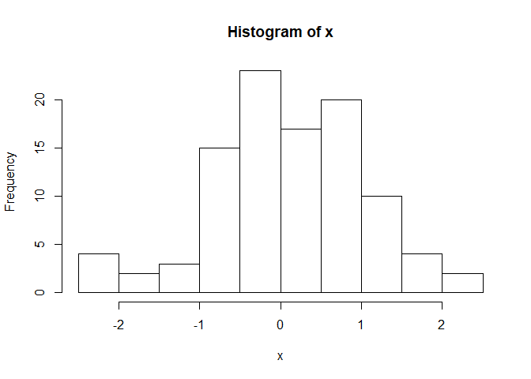

``` r
y <- rnorm(100)
plot(x,y, pch = 20) # labels x and y are defaulted as well
#example(points) to see the symbols that you want
legend("topleft", legend = "Data", pch = 20)
fit <- lm(y~ x)
abline(fit, lwd = 3, col = "blue") #adds a line that regresses
```

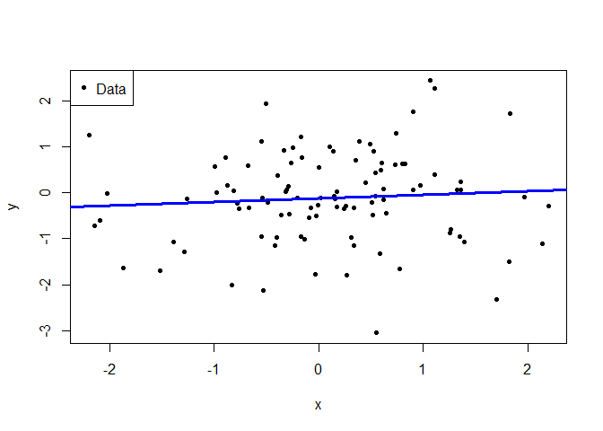

``` r
#new plot
plot(x, y, xlab = "x factor", ylab = "y factor", main = "scatterplot", pch = 20)
legend("topright", legend = "Data", pch = 20)
fit <- lm(y ~ x)
abline(fit, lwd = 3, col= "red")
```

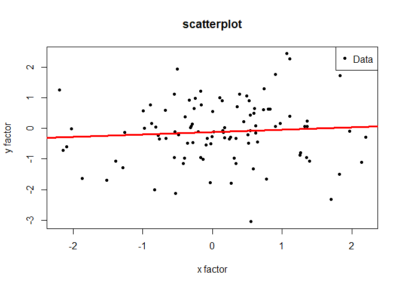

Lets say we want multiple plots.

``` r
z <- rpois(100, 2)
par(mfrow = c(2, 2), mar = c(3,3,1.5,1.5))
plot(x, y, pch = 20)
plot(x, z, pch = 19)
plot(y, z, pch = 20)
plot(x, y, pch = 20)
```

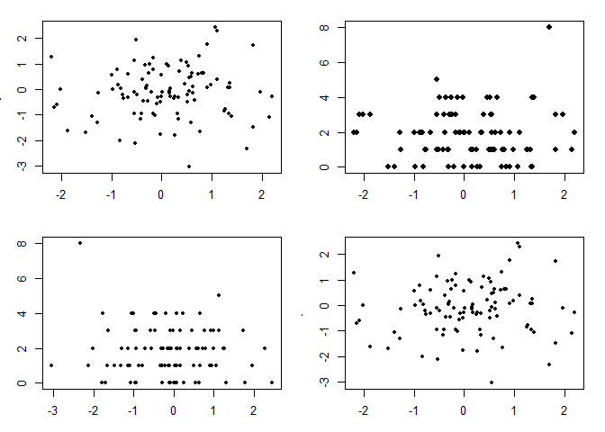

Points examples
---------------

``` r
par(mfrow = c(1,1))
x <- rnorm(100)
y <- x + rnorm(100)
g <- gl(2,50, labels = c("Male", "Female"))
str(g)
```

    ##  Factor w/ 2 levels "Male","Female": 1 1 1 1 1 1 1 1 1 1 ...

``` r
plot(x,y, type = "n")
points(x[g=='Male'], y[g =='Male'], col = "green")
points(x[g == 'Female'], y[g == 'Female'], col = "blue")
```

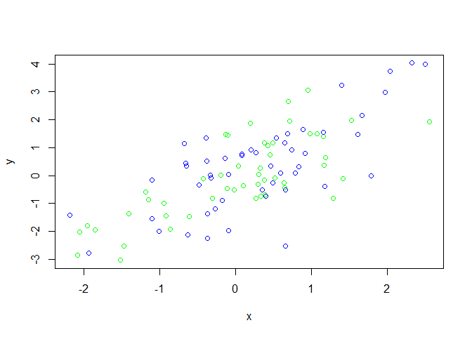

Graphics Devices
----------------

Somewhere you can ake a plot appear like a window (screen device = default R), pdf file, jpeg, etc. For presentations or documents, a file device is much more appropriate.

For file devices, we launch a graphic devices, call a plotting function (no plot will appear on the screen), annotate it and then close the graphics device with dev.off()

``` r
#Example
pdf(file = "myplot.pdf")
with(faithful, plot(eruptions, waiting))
title(main = "Old Faithful Geyser data")
dev.off() #saves into working directory
```

    ## png 
    ##   2

Two types of formats

### Vector Formats:

pdf: useful for line-type graphics, resizes and portable. Nor officient if plot has many objects. svg: XML - based scalable vector graphics; supports animation and interactivity. Useful for web-based plots win.metafile (only for Windows) postscript: older format, resizes well and usually portable.

### Bitmat formats

looks at a series of pixles. png: bit mapped format great for images and compression. Does not resize well. jpeg: great for photographers and natural scenes. Great for plotting many plots, but doesn't resize well. Can be read by any computer andb rowser but not great for line drawings. Tiff: creates bitmap files in TIFF and supports lossless compression bmp: a native Windows bitmapped format (maybe for icons.)

You can have multiple graphics devices open. dev.cur() can see what your current graphics devices is.

Can also copy plots via dev.copy()
