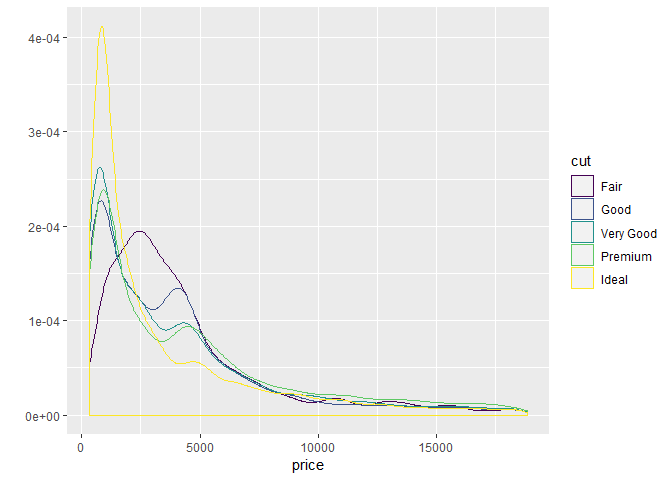

Lecture - Week 2
================
Ziq
March 22, 2019

Lattice Plotting System
-----------------------

One function call. No annotations unlike the base.

**Functions** - xyplot: scatterplots - bwplot: box and wisker plots - histogram: histograms - stripplot: box ploot with points - dotplot: dots on "violin strings" - splom: scatterplot matrix - levelplot, contour plot: plots image data

``` r
#xyplot(y ~ x | f * g, data)
```

So on the left is the y variable, right variable. After that, you see the conditioning variables (optional) as well as teh dataframe. If no data frame or list is passed then the parent frame is used (?).

ggplot2
-------

### qplot()

works like the plot function, looks for data in a dataframe (no specification means that it'll look for it), and plots are made up of aesthetics (size, shape, color) and geoms (points, lines) Factors are important (should be labeled) qplot hides al ot of what happens underneath and ggplot does a lot of the work.

It's an implementation of the Grammar of Graphics by Leland Wikinson.

### Basic components of a ggpot2 plot

-   a Data Frame
-   Aesthetic mappings: how data are mapped to color, size
-   geoms, geometric objcts ike points, lines, shapes
-   faets: for conditional plots
-   stats: statistical transformation like binning, quantiles, smoothing
-   scales: what scale an esthetic map uses(male = red, female = blue)
-   coordinate system

Example dataset
===============

``` r
library(ggplot2)
library(datasets)
str(mpg)
```

    ## Classes 'tbl_df', 'tbl' and 'data.frame':    234 obs. of  11 variables:
    ##  $ manufacturer: chr  "audi" "audi" "audi" "audi" ...
    ##  $ model       : chr  "a4" "a4" "a4" "a4" ...
    ##  $ displ       : num  1.8 1.8 2 2 2.8 2.8 3.1 1.8 1.8 2 ...
    ##  $ year        : int  1999 1999 2008 2008 1999 1999 2008 1999 1999 2008 ...
    ##  $ cyl         : int  4 4 4 4 6 6 6 4 4 4 ...
    ##  $ trans       : chr  "auto(l5)" "manual(m5)" "manual(m6)" "auto(av)" ...
    ##  $ drv         : chr  "f" "f" "f" "f" ...
    ##  $ cty         : int  18 21 20 21 16 18 18 18 16 20 ...
    ##  $ hwy         : int  29 29 31 30 26 26 27 26 25 28 ...
    ##  $ fl          : chr  "p" "p" "p" "p" ...
    ##  $ class       : chr  "compact" "compact" "compact" "compact" ...

``` r
qplot(displ, hwy, data = mpg)
```


``` r
qplot(displ, hwy, data = mpg, color = drv) #auto legend is created
```


``` r
qplot(displ, hwy, data=mpg, geom = c("point", "smooth")) #adds a smooth line for trends
```

    ## `geom_smooth()` using method = 'loess' and formula 'y ~ x'


``` r
qplot(hwy, data = mpg, fill = drv) #makes a histogram with one argument, fills by factor colors
```

    ## `stat_bin()` using `bins = 30`. Pick better value with `binwidth`.


``` r
qplot(displ, hwy, data = mpg, facets =.~drv) #facets are like panels. So here we can split it into different plotss
```


``` r
#the dot beside drv means that the it's one row and the columns are specified by drv
# the dot to the right of drv specifies one column and the rows are specified by drv
qplot(hwy, data = mpg, facets = drv~.)
```

    ## `stat_bin()` using `bins = 30`. Pick better value with `binwidth`.


More Examples
-------------

``` r
qplot(drv, hwy, data = mpg, geom = "boxplot", color = manufacturer) #boxplot
```


``` r
qplot(hwy, data = mpg, fill = drv) #histogram
```

    ## `stat_bin()` using `bins = 30`. Pick better value with `binwidth`.


``` r
g <- ggplot(mpg, aes(displ, hwy))
g + geom_point()
```


``` r
g+geom_point()+geom_smooth(method = "lm")
```


``` r
g+geom_point()+geom_smooth(method = "lm") + facet_grid(.~drv) + ggtitle("Swirl Rules!")
```


``` r
#aesthetics
g + geom_point(color = "pink", size = 4, alpha = 1/2)
```


``` r
g + geom_point(size = 4, alpha = 1/2, aes(color = drv))
```


``` r
g + geom_point(aes(color = drv)) + labs(title = "Swirl Rules!") + labs(x = "Displacement", y = "Hwy Mileage")
```


``` r
g + geom_point(aes(color = drv), size = 2, alpha = 1/2) + geom_smooth(size = 4, linetype = 3, method = "lm", se = FALSE)
```


``` r
#se are the gray shadow
```

So qpot() is analog to plot() with many built-in features, and produces publication-ready graphics

So a lot of the times you'd want to add a smooth layer to understand what the general trend is. So there's a smoother built in called geom\_smooth(), but you can also make it geom\_smooth(method="lm") for a linear regression model.

So adding layers, we start with g&lt;- ggplot(dataframe, aes(x, y)) then we can add to it like g + geom\_point() + geom\_smooth(method = "lm") + facet\_grid(. ~ factor variable) Note that order doesn't matter

Annotations
-----------

labes: xlab, ylab, labs, ggtitle() There are global things too, which is theme(legend.position="") Standard appearances themes include - (theme\_gray() - theme\_bw()

Modifying Aesthetics
--------------------

geom\_point(color = "steelblue", size = 4, alpha = 1/2) This is a constant color value. Or: geom\_point(aes(color = bmicat), size = 4, alpha = 1/2) This is assigning color to a variable which requires calling aes. labs(title = 'title') + labs(x = expression("log " \* PM\[2.5\]), y = "Nocturnal Smymptoms") geom\_line() makes a line plot instead of geom\_point plots

For outliers,naturally ggplot includes everything. Using ylim will subset data that is within the range. So in order to include everything you'd use coord\_cartesian(yim=c(range))

``` r
g <- ggplot(mpg, aes(x = displ, y = hwy, color = factor(year)))
g + geom_point() + facet_grid(drv~cyl, margins = TRUE)
```


Marking Continuous Variables Categorical
----------------------------------------

First use cutpoints &lt;- quantile(data*v**a**r*, *s**e**q*(0, 1, *l**e**n**g**h**t**h* = *q**u**a**r**t**i**l**e**s* − 1),*n**a*.*r**m* = *T**R**U**E*)*T**h**e**n**u**s**e**c**u**t*(*d**a**t**a*var, cutpoints) to create new factor variables

Colors
------

colors() has about 600+ colors, but colorRamp and colorRampPalette gives you blending options to blend colors together

We use alpha = 0.3 which represents the opacity to get a better picture of where the points are more dense towards.

More examples!
--------------

with the diamond dataset

``` r
#histogram
qplot(price, data=diamonds, binwidth = 18497/30, fill = cut) #binwidth should be range/30
```


``` r
qplot(price, data = diamonds, geom = "density") # density function
```


``` r
qplot(price, data = diamonds, geom = "density", color = cut)
```



``` r
#qplot(carat, price, data = diamonds, shape = cut)
#qplot(carat,price,data=diamonds, color=cut) + geom_smooth(method="lm")
#plot(carat,price,data=diamonds, color=cut, facets = .~cut) + geom_smooth(method="lm")
#cutpoints <- quantile(diamonds$carat,seq(0,1,length=4),na.rm=TRUE)
#diamonds$car2 <- cut(diamonds$carat,cutpoints)
#g <- ggplot(data = diamonds, aes(depth, price))
```
