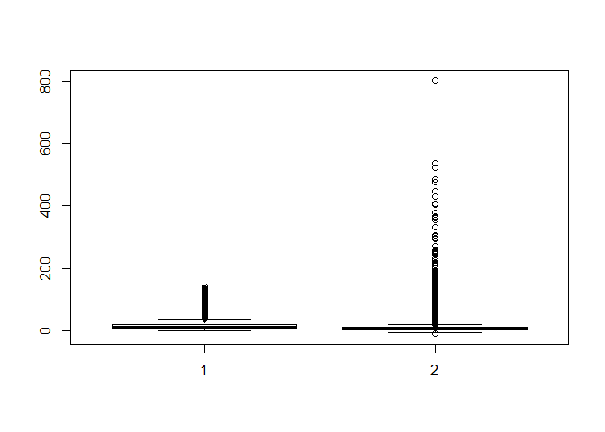
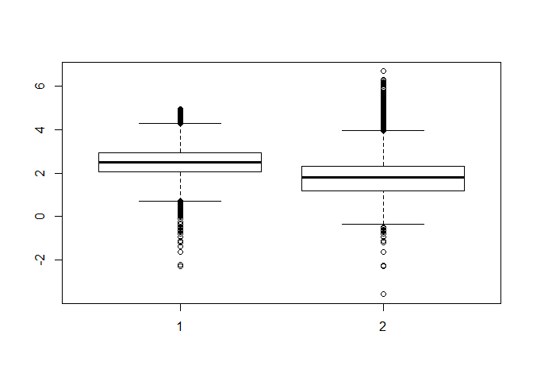
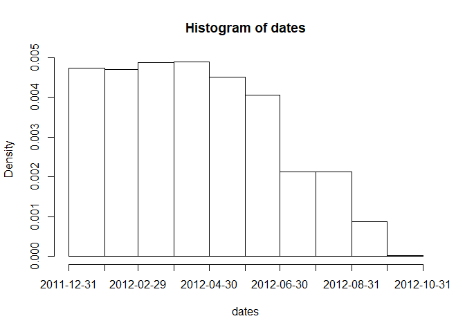
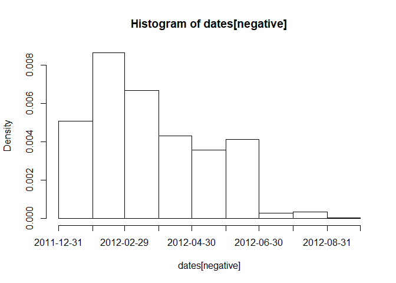
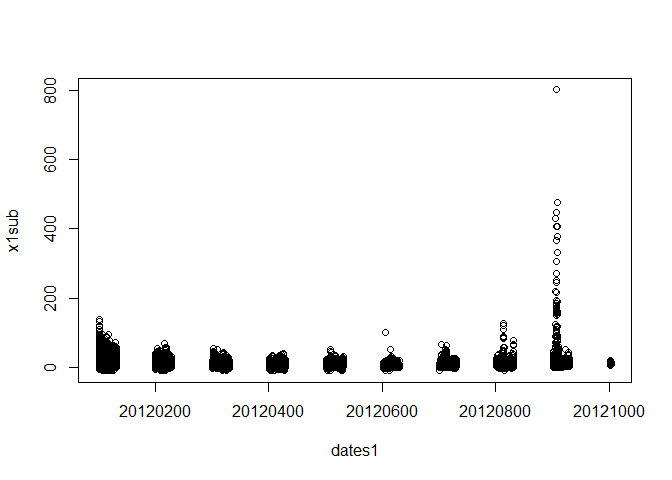
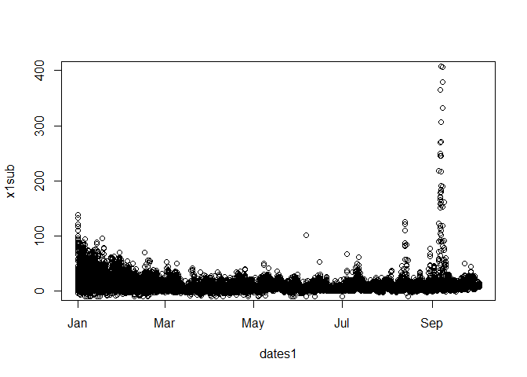
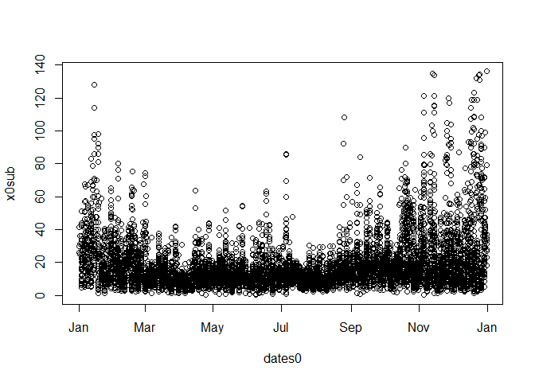
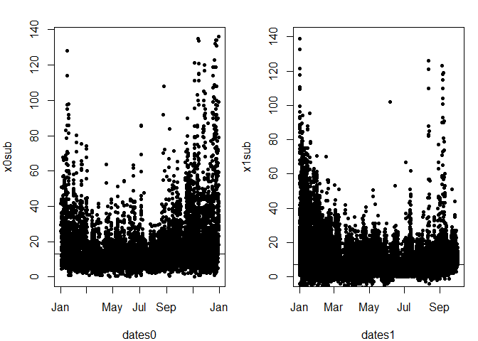

Lecture - Week 4 - Air Pollution Case Study
================
Ziq
March 24, 2019

So basically with this dataset is that it's to look at the dust in the air. There's been a clean air act and we want to see if today we have cleaner air.

We want a question. Basically are air quality levels lower?

``` r
pm0 <- read.table("RD_501_88101_1999-0.txt", comment.char = "#", header = FALSE, sep = "|", na.strings = "")
```

    ## Warning in scan(file = file, what = what, sep = sep, quote = quote, dec =
    ## dec, : number of items read is not a multiple of the number of columns

``` r
cnames <- readLines("RD_501_88101_1999-0.txt", 1)
cnames <- strsplit(cnames, "|", fixed = TRUE)
names(pm0) <- cnames[[1]]

head(pm0)
```

    ##   # RD Action Code State Code County Code Site ID Parameter POC
    ## 1   RD           I          1          27       1     88101   1
    ## 2   RD           I          1          27       1     88101   1
    ## 3   RD           I          1          27       1     88101   1
    ## 4   RD           I          1          27       1     88101   1
    ## 5   RD           I          1          27       1     88101   1
    ## 6   RD           I          1          27       1     88101   1
    ##   Sample Duration Unit Method     Date Start Time Sample Value
    ## 1               7  105    120 19990103      00:00           NA
    ## 2               7  105    120 19990106      00:00           NA
    ## 3               7  105    120 19990109      00:00           NA
    ## 4               7  105    120 19990112      00:00        8.841
    ## 5               7  105    120 19990115      00:00       14.920
    ## 6               7  105    120 19990118      00:00        3.878
    ##   Null Data Code Sampling Frequency Monitor Protocol (MP) ID Qualifier - 1
    ## 1             AS                  3                       NA          <NA>
    ## 2             AS                  3                       NA          <NA>
    ## 3             AS                  3                       NA          <NA>
    ## 4           <NA>                  3                       NA          <NA>
    ## 5           <NA>                  3                       NA          <NA>
    ## 6           <NA>                  3                       NA          <NA>
    ##   Qualifier - 2 Qualifier - 3 Qualifier - 4 Qualifier - 5 Qualifier - 6
    ## 1            NA            NA            NA            NA            NA
    ## 2            NA            NA            NA            NA            NA
    ## 3            NA            NA            NA            NA            NA
    ## 4            NA            NA            NA            NA            NA
    ## 5            NA            NA            NA            NA            NA
    ## 6            NA            NA            NA            NA            NA
    ##   Qualifier - 7 Qualifier - 8 Qualifier - 9 Qualifier - 10
    ## 1            NA            NA            NA             NA
    ## 2            NA            NA            NA             NA
    ## 3            NA            NA            NA             NA
    ## 4            NA            NA            NA             NA
    ## 5            NA            NA            NA             NA
    ## 6            NA            NA            NA             NA
    ##   Alternate Method Detectable Limit Uncertainty
    ## 1                                NA          NA
    ## 2                                NA          NA
    ## 3                                NA          NA
    ## 4                                NA          NA
    ## 5                                NA          NA
    ## 6                                NA          NA

``` r
names(pm0) <- make.names(cnames[[1]])
head(pm0)
```

    ##   X..RD Action.Code State.Code County.Code Site.ID Parameter POC
    ## 1    RD           I          1          27       1     88101   1
    ## 2    RD           I          1          27       1     88101   1
    ## 3    RD           I          1          27       1     88101   1
    ## 4    RD           I          1          27       1     88101   1
    ## 5    RD           I          1          27       1     88101   1
    ## 6    RD           I          1          27       1     88101   1
    ##   Sample.Duration Unit Method     Date Start.Time Sample.Value
    ## 1               7  105    120 19990103      00:00           NA
    ## 2               7  105    120 19990106      00:00           NA
    ## 3               7  105    120 19990109      00:00           NA
    ## 4               7  105    120 19990112      00:00        8.841
    ## 5               7  105    120 19990115      00:00       14.920
    ## 6               7  105    120 19990118      00:00        3.878
    ##   Null.Data.Code Sampling.Frequency Monitor.Protocol..MP..ID Qualifier...1
    ## 1             AS                  3                       NA          <NA>
    ## 2             AS                  3                       NA          <NA>
    ## 3             AS                  3                       NA          <NA>
    ## 4           <NA>                  3                       NA          <NA>
    ## 5           <NA>                  3                       NA          <NA>
    ## 6           <NA>                  3                       NA          <NA>
    ##   Qualifier...2 Qualifier...3 Qualifier...4 Qualifier...5 Qualifier...6
    ## 1            NA            NA            NA            NA            NA
    ## 2            NA            NA            NA            NA            NA
    ## 3            NA            NA            NA            NA            NA
    ## 4            NA            NA            NA            NA            NA
    ## 5            NA            NA            NA            NA            NA
    ## 6            NA            NA            NA            NA            NA
    ##   Qualifier...7 Qualifier...8 Qualifier...9 Qualifier...10
    ## 1            NA            NA            NA             NA
    ## 2            NA            NA            NA             NA
    ## 3            NA            NA            NA             NA
    ## 4            NA            NA            NA             NA
    ## 5            NA            NA            NA             NA
    ## 6            NA            NA            NA             NA
    ##   Alternate.Method.Detectable.Limit Uncertainty
    ## 1                                NA          NA
    ## 2                                NA          NA
    ## 3                                NA          NA
    ## 4                                NA          NA
    ## 5                                NA          NA
    ## 6                                NA          NA

``` r
x0 <- pm0$Sample.Value
class(x0)
```

    ## [1] "numeric"

``` r
str(x0)
```

    ##  num [1:30298] NA NA NA 8.84 14.92 ...

``` r
summary(x0)
```

    ##    Min. 1st Qu.  Median    Mean 3rd Qu.    Max.    NA's 
    ##    0.00    7.80   12.20   15.22   19.00  140.40    4096

``` r
mean(is.na(x0)) #14% are missing. Does the missing value matter? Let's compare it to pm1
```

    ## [1] 0.1351904

``` r
pm1 <- read.table("RD_501_88101_2012-0.txt", comment.char = "#", header = FALSE, sep = "|", na.strings = "")
```

    ## Warning in scan(file = file, what = what, sep = sep, quote = quote, dec =
    ## dec, : number of items read is not a multiple of the number of columns

``` r
dim(pm1)
```

    ## [1] 117013     28

``` r
names(pm1) <- make.names(cnames[[1]])
x1 <- pm1$Sample.Value
```

Let's compare x0 and dx1

``` r
summary(x0)
```

    ##    Min. 1st Qu.  Median    Mean 3rd Qu.    Max.    NA's 
    ##    0.00    7.80   12.20   15.22   19.00  140.40    4096

``` r
summary(x1) #mean has decreased by half and median has decreased by half. But why are there negative values?
```

    ##    Min. 1st Qu.  Median    Mean 3rd Qu.    Max.    NA's 
    ## -10.000   3.000   6.000   7.708  10.000 801.000    4728

``` r
mean(is.na(x1)) #NA percentage has decreased with higher overall observations.
```

    ## [1] 0.04040577

``` r
boxplot(x0, x1)
```



``` r
boxplot(log(x0),log(x1))
```

    ## Warning in log(x1): NaNs produced

    ## Warning in bplt(at[i], wid = width[i], stats = z$stats[, i], out =
    ## z$out[z$group == : Outlier (-Inf) in boxplot 1 is not drawn

    ## Warning in bplt(at[i], wid = width[i], stats = z$stats[, i], out =
    ## z$out[z$group == : Outlier (-Inf) in boxplot 2 is not drawn



How many negatives are there?

``` r
negative <- x1 < 0
sum(negative, na.rm = TRUE)
```

    ## [1] 4088

``` r
mean(negative, na.rm = TRUE)
```

    ## [1] 0.03640736

``` r
dates <- pm1$Date
dates <- as.Date(as.character(dates), "%Y%m%d")
head(dates)
```

    ## [1] "2012-01-01" "2012-01-04" "2012-01-07" "2012-01-10" "2012-01-13"
    ## [6] "2012-01-16"

``` r
hist(dates, "month")
```



``` r
hist(dates[negative], 'month')
```



``` r
site0 <- unique(subset(pm0, State.Code == 6, c(County.Code, Site.ID)))
site1 <- unique(subset(pm1, State.Code == 6, c(County.Code, Site.ID)))
head(site0)
```

    ##      County.Code Site.ID
    ## 6490           1       7
    ## 6501           1    1001
    ## 6591           7       2
    ## 6654           9       1
    ## 6718          11    1002
    ## 6830          13       2

``` r
site0 <- paste(site0[,1], site0[,2], sep = ".")
site1 <- paste(site1[,1], site1[,2], sep = ".")
str(site0)
```

    ##  chr [1:76] "1.7" "1.1001" "7.2" "9.1" "11.1002" "13.2" "17.11" "19.8" ...

``` r
str(site1)
```

    ##  chr [1:15] "1.7" "1.9" "7.2" "7.8" "9.1" "11.7" "11.1002" "13.2" ...

``` r
both <- intersect(site0, site1)
pm0$county.site <- with(pm0, paste(County.Code, Site.ID, sep = "."))
pm1$county.site <- with(pm1, paste(County.Code, Site.ID, sep = "."))
cnt0 <- subset(pm0, State.Code == 6 & county.site %in% both)
cnt1 <- subset(pm1, State.Code == 6 & county.site %in% both)
head(cnt0)
```

    ##      X..RD Action.Code State.Code County.Code Site.ID Parameter POC
    ## 6490    RD           I          6           1       7     88101   1
    ## 6491    RD           I          6           1       7     88101   1
    ## 6492    RD           I          6           1       7     88101   1
    ## 6493    RD           I          6           1       7     88101   1
    ## 6494    RD           I          6           1       7     88101   1
    ## 6495    RD           I          6           1       7     88101   1
    ##      Sample.Duration Unit Method     Date Start.Time Sample.Value
    ## 6490               7  105    120 19991202      00:00         14.9
    ## 6491               7  105    120 19991205      00:00         50.7
    ## 6492               7  105    120 19991208      00:00         15.5
    ## 6493               7  105    120 19991211      00:00         16.8
    ## 6494               7  105    120 19991214      00:00           NA
    ## 6495               7  105    120 19991217      00:00           NA
    ##      Null.Data.Code Sampling.Frequency Monitor.Protocol..MP..ID
    ## 6490           <NA>                  3                       NA
    ## 6491           <NA>                  3                       NA
    ## 6492           <NA>                  3                       NA
    ## 6493           <NA>                  3                       NA
    ## 6494             AI                  3                       NA
    ## 6495             AQ                  3                       NA
    ##      Qualifier...1 Qualifier...2 Qualifier...3 Qualifier...4 Qualifier...5
    ## 6490          <NA>            NA            NA            NA            NA
    ## 6491          <NA>            NA            NA            NA            NA
    ## 6492          <NA>            NA            NA            NA            NA
    ## 6493          <NA>            NA            NA            NA            NA
    ## 6494          <NA>            NA            NA            NA            NA
    ## 6495          <NA>            NA            NA            NA            NA
    ##      Qualifier...6 Qualifier...7 Qualifier...8 Qualifier...9
    ## 6490            NA            NA            NA            NA
    ## 6491            NA            NA            NA            NA
    ## 6492            NA            NA            NA            NA
    ## 6493            NA            NA            NA            NA
    ## 6494            NA            NA            NA            NA
    ## 6495            NA            NA            NA            NA
    ##      Qualifier...10 Alternate.Method.Detectable.Limit Uncertainty
    ## 6490             NA                                NA          NA
    ## 6491             NA                                NA          NA
    ## 6492             NA                                NA          NA
    ## 6493             NA                                NA          NA
    ## 6494             NA                                NA          NA
    ## 6495             NA                                NA          NA
    ##      county.site
    ## 6490         1.7
    ## 6491         1.7
    ## 6492         1.7
    ## 6493         1.7
    ## 6494         1.7
    ## 6495         1.7

``` r
sapply(split(cnt0, cnt0$county.site), nrow)
```

    ##     1.7 11.1002    13.2    19.8 23.1002     7.2     9.1 
    ##      11     112     138     379      60      63      64

``` r
sapply(split(cnt1, cnt1$county.site), nrow)
```

    ##     1.7 11.1002    13.2    19.8 23.1002     7.2     9.1 
    ##    6453      42     185     475      58      34    3648

``` r
pm1sub <- subset(pm1, State.Code == 6)
pm0sub <- subset(pm0, State.Code == 6)
dates1 <- pm1sub$Date
x1sub <- pm1sub$Sample.Value
plot(dates1, x1sub)
```



``` r
dates1 <- as.Date(as.character(dates1), "%Y%m%d")
str(dates1)
```

    ##  Date[1:33346], format: "2012-01-01" "2012-01-01" "2012-01-01" "2012-01-01" "2012-01-01" ...

``` r
plot(dates1, x1sub, ylim = c(0,400))
```



``` r
dates0 <- pm0sub$Date
dates0 <- as.Date(as.character(dates0), "%Y%m%d")
x0sub <- pm0sub$Sample.Value
plot(dates0, x0sub)
```



``` r
par(mfrow = c(1,2), mar = c(4,4,2,1))
plot(dates0, x0sub, pch = 20, alpha = 1/4)
```

    ## Warning in plot.window(...): "alpha" is not a graphical parameter

    ## Warning in plot.xy(xy, type, ...): "alpha" is not a graphical parameter

    ## Warning in axis(side, at = z, labels = labels, ...): "alpha" is not a
    ## graphical parameter

    ## Warning in axis(side = side, at = at, labels = labels, ...): "alpha" is not
    ## a graphical parameter

    ## Warning in box(...): "alpha" is not a graphical parameter

    ## Warning in title(...): "alpha" is not a graphical parameter

``` r
abline(h = median(x0sub, na.rm=T))
plot(dates1, x1sub, pch = 20, ylim = c(0,140))
abline(h = median(x1sub, na.rm=T))
```



``` r
mn0 <- with(pm0, tapply(Sample.Value, State.Code, mean, na.rm = TRUE))
str(mn0)
```

    ##  num [1:12(1d)] 19.96 6.67 10.8 15.68 17.66 ...
    ##  - attr(*, "dimnames")=List of 1
    ##   ..$ : chr [1:12] "1" "2" "4" "5" ...

``` r
summary(mn0)
```

    ##    Min. 1st Qu.  Median    Mean 3rd Qu.    Max. 
    ##   5.051   9.980  13.884  13.164  16.254  19.956

``` r
mn1 <- with(pm1, tapply(Sample.Value, State.Code, mean, na.rm = TRUE))
summary(mn1)
```

    ##    Min. 1st Qu.  Median    Mean 3rd Qu.    Max. 
    ##   4.750   8.610   9.228   8.656  10.126  10.564
