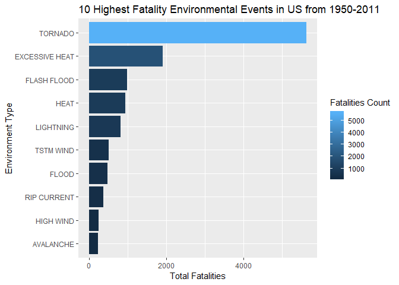
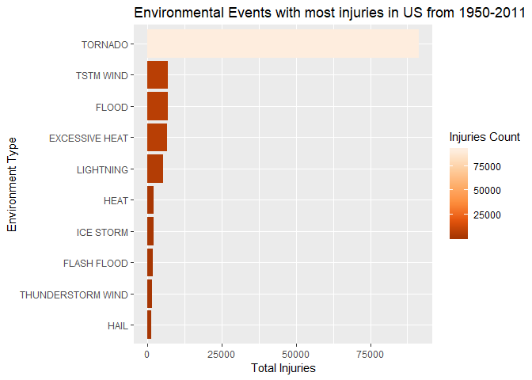
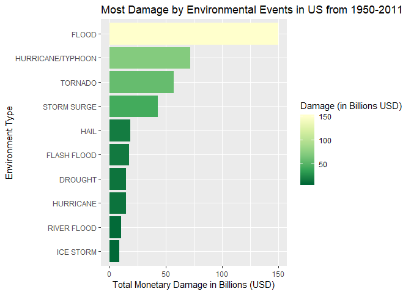

## Synopsis
This analysis explores the U.S. National Oceanic and Atmospheric Administraion's
(NOAA) storm database which tracks characteristics of major environmental events
in the United States, incorporating a databse from 1950-2011. The objective
of the analysis is to answer two basic questions: 

1. Across the United States, which types of events are most harmful with respect 
to population health (as depicted by fatality rates and injuries)?

2. Across the United States, which types of events have the greatest economic 
consequences (as calculated by property damage and crop damage)?

In the theme of reproducibility, literate programming will be utilized and readers will be able
to see all the code, as well as the analysis methodology utilized to reach the final output.

## Data Processing

Load data and the libraries that will be required for the analysis. Since the data was already
provided, the read.csv function will be able to load the data from the work directory. However,
a link has been provided to download the file for those that require access.


```r
library(ggplot2)
library(dplyr)
```


```r
#url <- "https://d396qusza40orc.cloudfront.net/repdata%2Fdata%2FStormData.csv.bz2"
#download.file(url, "StormData.csv.bz2")
#bunzip2("StormData.csv.bz2", "StormData.csv")
#StormData <- read.csv("StormData.csv", sep = ",", stringsAsFactors = F)
#str(StormData)
StormData <- read.csv('repdata_data_StormData.csv')
dim(StormData)
```

```
## [1] 902297     37
```

Starting with just loading the dataset into R, we can easily see that the storm
data is a large file with 902,297 observations of 37 variables. We have to keep
in mind that the purpose of the analysis is to take a preliminary look at the 
the total damage of these environmental disasters in the U.S. as a whole, 
therefore are a lot of variables in the file that we're not necessarily
interested in. For example, we're not so interested in the specific locations 
like Country or States, just because we know that the locations are all 
encompassed in the U.S. which is the only concern in the questions we want to
address. Taking this further, we're also not interested at the time of these 
events nor the magnitude and size of the environmental disasters, but rather
just its damage. To select the variables that we want to use, we will use
the dplyr package.


```r
#Environmental Damage data from Jan 1950 - Nov 2011
EnvDamage <- select(StormData, EVTYPE, FATALITIES:CROPDMGEXP)
str(EnvDamage)
```

```
## 'data.frame':	902297 obs. of  7 variables:
##  $ EVTYPE    : Factor w/ 985 levels "   HIGH SURF ADVISORY",..: 834 834 834 834 834 834 834 834 834 834 ...
##  $ FATALITIES: num  0 0 0 0 0 0 0 0 1 0 ...
##  $ INJURIES  : num  15 0 2 2 2 6 1 0 14 0 ...
##  $ PROPDMG   : num  25 2.5 25 2.5 2.5 2.5 2.5 2.5 25 25 ...
##  $ PROPDMGEXP: Factor w/ 19 levels "","-","?","+",..: 17 17 17 17 17 17 17 17 17 17 ...
##  $ CROPDMG   : num  0 0 0 0 0 0 0 0 0 0 ...
##  $ CROPDMGEXP: Factor w/ 9 levels "","?","0","2",..: 1 1 1 1 1 1 1 1 1 1 ...
```

Here we notice that the property damage and crop damage has some interesting
levels of factors that are beyond the levels stated in the document. The factors
will be corrected to correspond to this [link](https://rstudio-pubs-static.s3.amazonaws.com/58957_37b6723ee52b455990e149edde45e5b6.html)
which is an analysis done for the PROPDMGEXP and CROPDMGEXP variables. 

In summary, the possible values of PROPDMGEXP and CROPDMGEXP are H,h,K,k,M,m,B,b,+,-,?,0,1,2,3,4,5,6,7,8, and *NULL* ("").

Each value corresponds to a **multiple** to the numerical PROPDMG or CROPDMG:

* "" = 0
* "?" = 0
* "-" = 0
* "+" = 1
* 0,...,8 = 10
* H, h = 100
* K, k = 1,000
* M, m = 1,000,000
* B, b = 1,000,000,000

With this in mind, we will transform our data again, this this time to select
numerical values that accurately depicts the multiples, and create a new variable that
accounts for the total combined damage from property and crop sources.


```r
EnvDamage$PROPDMGEXP <- as.character(EnvDamage$PROPDMGEXP)
EnvDamage$CROPDMGEXP <- as.character(EnvDamage$CROPDMGEXP)
EnvDamage <- mutate(EnvDamage, 
                    Property_Damage = 
                        case_when(PROPDMGEXP %in% c("B", "b") ~ PROPDMG * 10^9,
                                  PROPDMGEXP %in% c("M", "m") ~ PROPDMG * 10^6,
                                  PROPDMGEXP %in% c("K", "k") ~ PROPDMG * 10^3,
                                  PROPDMGEXP %in% c("H", "h") ~ PROPDMG * 10^2,
                                  PROPDMGEXP %in% as.character(0:8) ~ PROPDMG * 10,
                                  PROPDMGEXP == "-" ~ PROPDMG,
                                  TRUE ~ 0)
                    )
EnvDamage <- mutate(EnvDamage, 
                    Crop_Damage = 
                        case_when(CROPDMGEXP %in% c("B", "b") ~ CROPDMG * 10^9,
                                  CROPDMGEXP %in% c("M", "m") ~ CROPDMG * 10^6,
                                  CROPDMGEXP %in% c("K", "k") ~ CROPDMG * 10^3,
                                  CROPDMGEXP %in% c("H", "h") ~ CROPDMG * 10^2,
                                  CROPDMGEXP %in% as.character(0:8) ~ CROPDMG * 10,
                                  CROPDMGEXP == "-" ~ CROPDMG,
                                  TRUE ~ 0)
                    )
EnvDamage <- mutate(EnvDamage,
                    Total_Damage = Property_Damage + Crop_Damage)
```

Now that we have a new columns with the damages, we can start our analysis
to address the two questions stated earlier.

## Results

### Across the United States, which types of events are most harmful with respect to population health?

Here we have a loosely defined population health because it doesn't entirely
specify what it's asking for in respect to fatalities and injuries. Arguably,
fatalities may depict a more accurate picture because it's difficult to associate
the severity of the injuries caused by the environmental types. Furthermore,
since we have about 985 levels of EVTYPE, we probably only care about the 
biggest select few of environmental types.


```r
All_Fatalities = sum(EnvDamage$FATALITIES)
All_Injuries = sum(EnvDamage$INJURIES)
EnvFatalities <- 
    EnvDamage %>% 
    group_by(EVTYPE) %>%
    summarise(Total_Fatalities = sum(FATALITIES),
              Total_Injuries = sum(INJURIES),
              Total_Injuries_Proportion = sum(INJURIES)/All_Injuries,
              Total_Fatalities_Proportion = sum(FATALITIES)/All_Fatalities) %>%
    arrange(desc(Total_Fatalities))
head(EnvFatalities, 5)
```

```
## # A tibble: 5 x 5
##   EVTYPE Total_Fatalities Total_Injuries Total_Injuries_~ Total_Fatalitie~
##   <fct>             <dbl>          <dbl>            <dbl>            <dbl>
## 1 TORNA~             5633          91346           0.650            0.372 
## 2 EXCES~             1903           6525           0.0464           0.126 
## 3 FLASH~              978           1777           0.0126           0.0646
## 4 HEAT                937           2100           0.0149           0.0619
## 5 LIGHT~              816           5230           0.0372           0.0539
```

To depict this in a graph, we will take only the first 10 Environmental types 
as it already accounts for 80% of the total fatalities and 90% of the total
number of injuries, providing a great general picture of what we want.


```r
EnvFatalities[1:10,] %>%
    ggplot(aes(x = reorder(EVTYPE, Total_Fatalities), 
               y = Total_Fatalities,
               fill = Total_Fatalities)) +
    geom_bar(stat = 'identity') + 
    #theme(axis.text.x = element_text(angle = 90, vjust = 0.5, hjust = 1)) + 
    labs(title = '10 Highest Fatality Environmental Events in US from 1950-2011',
         x = 'Environment Type',
         y = 'Total Fatalities') +
    scale_fill_continuous(name = 'Fatalities Count') +
    coord_flip()
```

<!-- -->


```r
(EnvFatalities %>%
     arrange(-Total_Injuries))[1:10,] %>%
    ggplot(aes(x = reorder(EVTYPE, Total_Injuries),
               y = Total_Injuries,
               fill = Total_Injuries)) +  
    geom_bar(stat='identity') + 
    #theme(axis.text.x = element_text(angle = 90, vjust = 0.5, hjust = 1)) + 
    labs(title = 'Environmental Events with most injuries in US from 1950-2011',
         x = 'Environment Type',
         y = 'Total Injuries') +
    scale_fill_distiller(name = 'Injuries Count', palette = "Oranges") +
    coord_flip()
```

<!-- -->

As depicted in the above graphs, the tornado was the most devastating, causing
the most amount injuries and fatalities, accounting for 65% of total injuries 
and 37% of total fatalities across all environment types.

### Across the United States, which types of events have the greatest economic consequences?


```r
(EnvDamage %>%
    group_by(EVTYPE) %>%
    summarise(All_Damage = sum(Total_Damage)/10^9) %>%
    arrange(-All_Damage))[1:10,] %>%
    ggplot(aes(x = reorder(EVTYPE, All_Damage),
               y = All_Damage,
               fill = All_Damage)) + 
    geom_bar(stat = 'identity') + 
   # theme(axis.text.x = element_text(angle = 90, vjust = 0.5, hjust = 1)) +
    labs(title = 'Most Damage by Environmental Events in US from 1950-2011',
         x = 'Environment Type',
         y = 'Total Monetary Damage in Billions (USD)') + 
    scale_fill_distiller(name = 'Damage (in Billions USD)', palette = "YlGn") +
    coord_flip()
```

<!-- -->

The flood caused the most damage, with a combined monetary value from property
and crop damage of $150 Billion USD.

